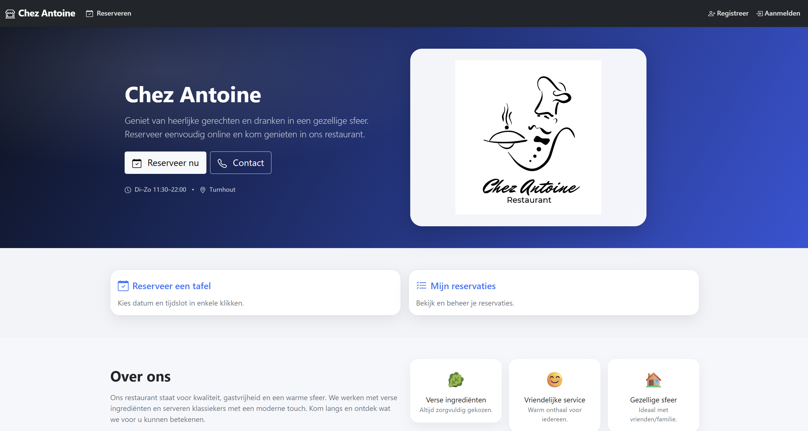
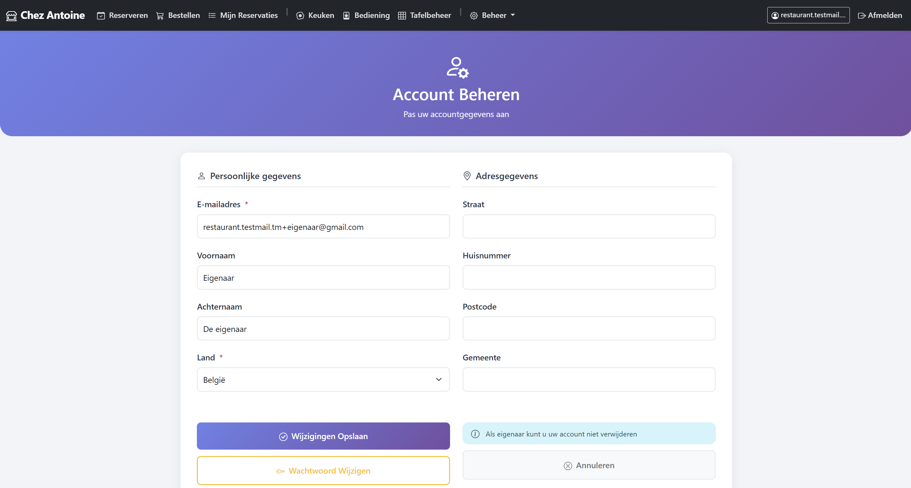
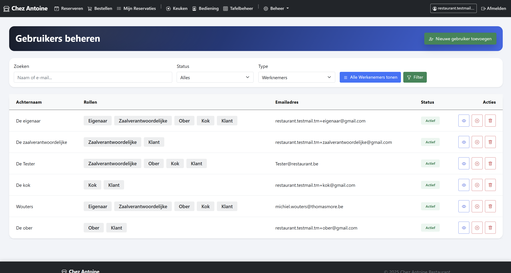
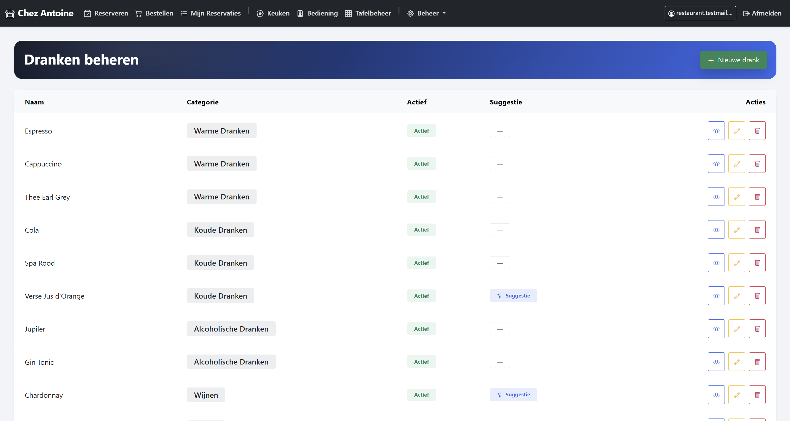

# Bewijsbeschrijving

Voor deze opdracht moesten we als groep aan de hand van de eisen van een klant een restaurant applicatie maken via het MVC C# .NET principe.

We zijn gestart via een analysebeschrijving dat we hadden gekregen, hierbij moesten we zowel een database als webapplicatie opmaken waarbij gebruikers reservaties kunnen maken, bestellingen kunnen plaatsen en kunnen betalen. Ook kan een zaalverantwoordelijke een overzicht zien van reservaties en deze koppelen aan tafels. Daarnaast kunnen obers en koks bestellingen zien en hiervan de status aanpassen. Als laatste kan de eigenaar ook de menu aanpassen en gebruikers beheren.

Hiervoor hebben we verschillende pagina's gemaakt waarbij veel CRUD-operaties aan bod kwamen. Hierbij hebben we data op een correcte en veilige manier opgehaald van de database en getoond op de nodige pagina's.

Op de pagina's zelf hebben we dan een mooie consistente layout gebruikt voor een goede user experience.

Door deze opdracht heb ik veel bijgeleerd over het MVC principe waarbij de data op een correcte manier wordt opgeslagen en opgehaald. Ook heb ik veel bijgeleerd op vlak van feedback geven en krijgen, dit aangezien we elkaars werk moesten reviewen.

## Voorbeelden

